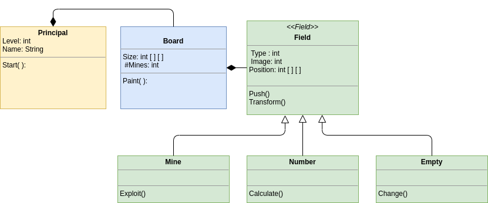

    

# Minesweeper
MineField is a game where the player must search for mines on a board, it is divided into three levels: beginner, intermediate and expert.

The main idea of the game is for the player to discover where the mines are on the board, for this he must press on each field and discover what is below this space, to facilitate the game the player will be given a series of clues with numbers. The rules will be explained later.

## Class Diagram

The model was designed with three main objects and three that derive from the field object, in total there are six objects which are: Main, Board, Field, Mine, Empty and Number
below you can view the preliminary diagram of the model

    

***This is the preliminary model, not the final yet.***